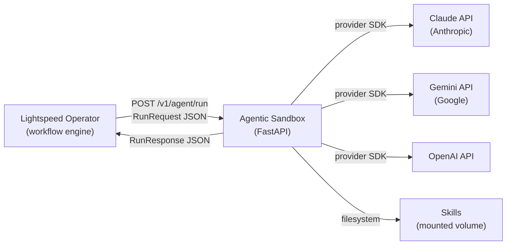
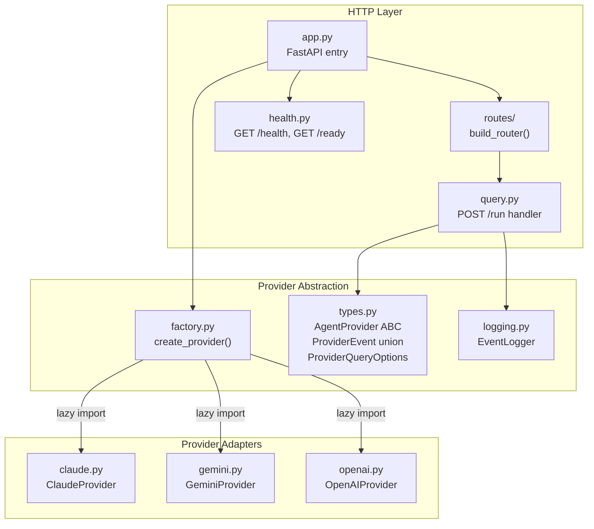
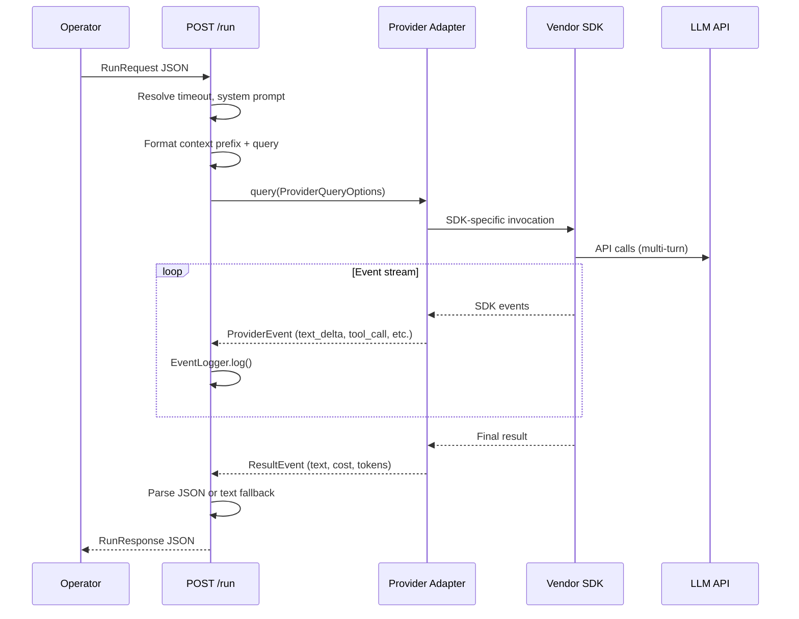
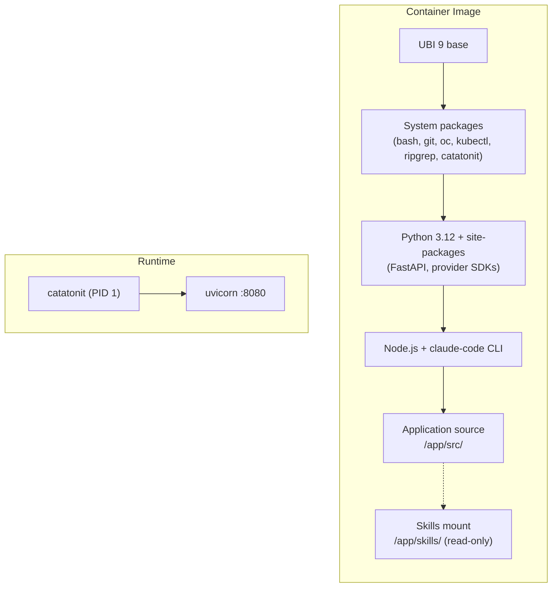

# Architecture

The lightspeed-agentic-sandbox is a multi-provider agent runtime for OpenShift Lightspeed. It runs as a FastAPI application inside ephemeral Kubernetes pods, accepting structured queries from the Lightspeed operator and delegating execution to one of three LLM provider SDKs.

## System Context

The sandbox sits between the operator (workflow engine) and the LLM provider APIs. It is a stateless worker — each pod processes one query and is disposable.

## Internal Architecture

The application has a layered design: HTTP routes parse requests and format responses, the provider abstraction normalizes query options and events, and thin adapters map between the normalized interface and each vendor SDK.

## Request Flow

A single request flows through the system as follows:

## Provider Adapter Design

Each adapter is a thin wrapper. The SDK owns tool execution, skill discovery, and multi-turn orchestration. Adapters are responsible only for:

1. Mapping `ProviderQueryOptions` to SDK-specific configuration
2. Consuming SDK event streams and yielding normalized `ProviderEvent` objects
3. Extracting cost and token usage from SDK results

| Provider | SDK | Structured Output | Skills | Tools |
|---|---|---|---|---|
| Claude | `claude-agent-sdk` | `output_format` JSON schema | Native `skills="all"` | Built-in SDK tools |
| Gemini | `google-adk` | Response schema on content config | `SkillToolset` from directory | `ExecuteBashTool` + web tools |
| OpenAI | `openai-agents` | `output_type` wrapper | `Skills` capability | `SandboxAgent` shell/filesystem |

## Container & Deployment

The sandbox ships as a container image built with Konflux hermetic builds (all dependencies prefetched, no network during build).

The container runs as a non-root `agent` user. `catatonit` is the init process (PID 1). Uvicorn serves the FastAPI app on port 8080.

## Key Decisions

- **One provider per pod:** The provider is selected at startup via `LIGHTSPEED_AGENT_PROVIDER`. This keeps pods simple and disposable — the operator chooses which provider to target when creating the pod.

- **Thin adapters over abstraction layers:** Provider modules map SDK events to a normalized union type but do not re-implement SDK behavior. This keeps maintenance cost proportional to SDK surface, not to a custom abstraction.

- **Lazy SDK imports:** Provider SDK packages are optional extras. The factory uses `match`-based lazy imports so the base package loads without any vendor SDK installed.

- **Hermetic builds:** All dependencies (Python wheels, RPMs, npm packages, external binaries) are declared in lockfiles and prefetched before the build starts. This ensures reproducible, auditable images.
